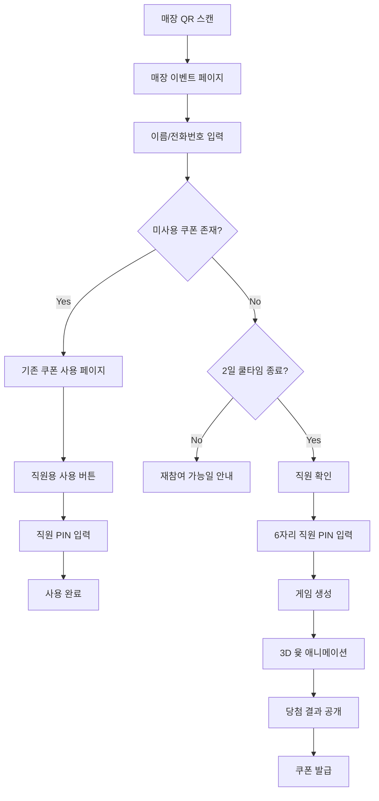
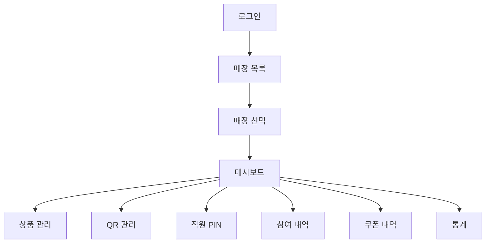

# USER FLOW

## 고객 Flow

## 고객 Route
### `/s/{storeToken}`
- 매장명
- 이벤트 안내
- 네이버 리뷰 안내
- 참여 버튼

### `/s/{storeToken}/identify`
- 이름
- 전화번호
- 개인정보 동의

### `/s/{storeToken}/coupon/{couponToken}`
- 상품명
- 상태
- 사용 가능일
- 만료일
- 직원용 사용 버튼

### `/s/{storeToken}/staff-verify`
- 직원 PIN 6자리 입력

### `/s/{storeToken}/game`
- 3D 윷놀이

### `/s/{storeToken}/result/{playId}`
- 윷 결과
- 당첨상품
- 사용 가능기간

## 관리자 Flow

## 고객 식별 후 판정 우선순위
1. Store 활성 상태
2. QR 유효성
3. 미사용 쿠폰
4. 최근 참여일
5. 2일 쿨타임
6. 직원 PIN
7. 게임 생성
