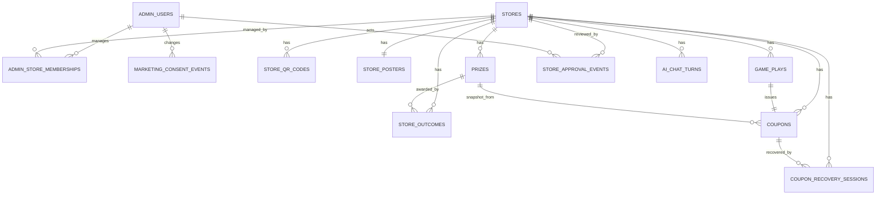

# ERD / DATABASE DESIGN

## ERD


`rate_counters`는 어느 테이블과도 FK로 연결하지 않는다. 문자열 버킷 키만 보는 독립 카운터다.

## `admin_users`
| Column | Type | Note |
|---|---|---|
| id | BIGINT | PK |
| email | VARCHAR(255) | UNIQUE |
| password_hash | VARCHAR(255) | |
| name | VARCHAR(100) | 대표자 이름 |
| phone | VARCHAR(30) | 대표 연락처 |
| role | VARCHAR(30) | SYSTEM_ADMIN / STORE_ADMIN |
| created_at | DATETIME | |

## `marketing_consent_events`
서비스별 광고성 문자 수신동의와 철회를 덮어쓰지 않고 변경 이벤트로 보존한다. 발송 대상 판단은
`admin_user_id + service`의 최신 이벤트만 사용한다.

| Column | Type | Note |
|---|---|---|
| id | BIGINT | PK |
| admin_user_id | BIGINT | FK |
| service | VARCHAR(30) | YUT_REVIEW / REVIEW_PILOT / SODAM |
| agreed | BOOLEAN | true=동의, false=거부·철회 |
| consent_version | VARCHAR(20) | 표시한 동의문 버전 |
| source | VARCHAR(30) | SIGNUP / SETTINGS |
| changed_at | DATETIME | 선택 시각 |

인덱스: `(admin_user_id, service, changed_at)`

## `stores`
| Column | Type | Note |
|---|---|---|
| id | BIGINT | PK |
| name | VARCHAR(100) | 매장명 |
| business_number | VARCHAR(30) | nullable |
| phone | VARCHAR(30) | |
| address | VARCHAR(255) | |
| naver_place_url | VARCHAR(500) | |
| staff_pin_hash | VARCHAR(255) | 6자리 PIN hash |
| status | VARCHAR(20) | PENDING_APPROVAL / ACTIVE / INACTIVE / REJECTED |
| created_at | DATETIME | |
| updated_at | DATETIME | |

`status`에 `PENDING_APPROVAL`과 `REJECTED`가 추가됐다. 값만 늘어난 것이라 기존 행은 `ACTIVE`로
그대로 남고 백필이 필요 없다. 신규 매장만 `PENDING_APPROVAL`로 생성된다.

## `admin_store_memberships`
| Column | Type | Note |
|---|---|---|
| id | BIGINT | PK |
| admin_user_id | BIGINT | FK |
| store_id | BIGINT | FK |
| role | VARCHAR(30) | OWNER / MANAGER |
| created_at | DATETIME | |

제약:
```text
UNIQUE(admin_user_id, store_id)
```

## `store_qr_codes`
| Column | Type | Note |
|---|---|---|
| id | BIGINT | PK |
| store_id | BIGINT | FK |
| public_token | VARCHAR(100) | UNIQUE |
| status | VARCHAR(20) | ACTIVE / REVOKED |
| created_at | DATETIME | |
| revoked_at | DATETIME | nullable |

## `store_posters`
매장 생성 시 현재 공개 origin, 매장명, 활성 QR로 자동 생성되는 A6 비율 PNG 안내물이다.

| Column | Type | Note |
|---|---|---|
| id | BIGINT | PK |
| store_id | BIGINT | FK, UNIQUE |
| content_base64 | TEXT | PNG 원본의 Base64, 서버 저장 |
| public_origin | VARCHAR(500) | 생성 당시 공개 origin |
| created_at | DATETIME | |
| updated_at | DATETIME | |

Quick Tunnel 주소, 매장명 또는 QR 토큰이 바뀌면 같은 행을 새 PNG로 갱신한다.

## `prizes`
| Column | Type | Note |
|---|---|---|
| id | BIGINT | PK |
| store_id | BIGINT | FK |
| rank | INT | 1이 1등, 매장별 1~5 |
| name | VARCHAR(100) | |
| description | VARCHAR(500) | |
| redeem_policy | VARCHAR(30) | SAME_DAY/NEXT_DAY/ANYTIME |
| active | BOOLEAN | |
| created_at | DATETIME | |
| updated_at | DATETIME | |

제약:
```text
UNIQUE(store_id, rank)
```

## `store_outcomes`
매장별 윷 결과 가중치와 상품 슬롯 매핑. 매장당 정확히 5행.

| Column | Type | Note |
|---|---|---|
| id | BIGINT | PK |
| store_id | BIGINT | FK |
| yut_result | VARCHAR(20) | DO/GAE/GEOL/YUT/MO |
| weight | INT | 0~1000, 확률 = weight / sum(weight) |
| prize_rank | INT | 이 결과가 주는 상품 등급 |
| updated_at | DATETIME | |

제약:
```text
UNIQUE(store_id, yut_result)
```

사용 중인 `prize_rank`의 종류 수가 곧 그 매장의 등급 수다.
가중치는 등급이 아니라 결과에 붙는다. 화면에 실제로 떨어지는 것은
도개걸윷모 다섯 가지이고, 등급에 확률을 걸면 던져진 모양과 상품이
어긋날 수 있기 때문이다.

기본값(신규 매장):

| yut_result | weight | prize_rank |
|---|---|---|
| DO | 325 | 3 |
| GAE | 325 | 3 |
| GEOL | 125 | 2 |
| YUT | 125 | 2 |
| MO | 100 | 1 |

## `game_plays`
| Column | Type | Note |
|---|---|---|
| id | BIGINT | PK |
| public_id | CHAR(26) | ULID 권장 |
| store_id | BIGINT | FK |
| qr_code_id | BIGINT | FK |
| customer_name_encrypted | TEXT | AES-256-GCM |
| phone_hash | CHAR(64) | HMAC-SHA256 |
| phone_encrypted | TEXT | AES-GCM |
| phone_last4 | CHAR(4) | |
| yut_result | VARCHAR(20) | DO/GAE/GEOL/YUT/MO |
| prize_rank | INT | 발급 당시 상품 등급 |
| status | VARCHAR(20) | CREATED/REVEALED/CANCELLED |
| animation_seed | VARCHAR(100) | |
| idempotency_key | VARCHAR(100) | UNIQUE |
| played_date | DATE | Asia/Seoul |
| played_at | DATETIME | |
| revealed_at | DATETIME | nullable |

인덱스:
```text
INDEX(store_id, phone_hash, played_date)
INDEX(store_id, phone_hash, played_at)
INDEX(store_id, played_at)
```

## `coupons`
| Column | Type | Note |
|---|---|---|
| id | BIGINT | PK |
| store_id | BIGINT | FK |
| game_play_id | BIGINT | FK, UNIQUE |
| prize_id | BIGINT | FK |
| coupon_token | VARCHAR(100) | UNIQUE |
| phone_hash | CHAR(64) | 조회 최적화 |
| prize_name_snapshot | VARCHAR(100) | |
| prize_description_snapshot | VARCHAR(500) | |
| redeem_policy_snapshot | VARCHAR(30) | |
| prize_rank_snapshot | INT | 발급 시점 등급 동결 |
| status | VARCHAR(20) | ISSUED/REDEEMED/EXPIRED/CANCELLED |
| valid_from | DATETIME | |
| expires_at | DATETIME | |
| issued_at | DATETIME | |
| redeemed_at | DATETIME | nullable |

인덱스:
```text
INDEX(store_id, phone_hash, status)
INDEX(store_id, status)
INDEX(store_id, expires_at)
INDEX(store_id, issued_at)
```

## `rate_counters`
공개 API throttle과 로그인·PIN 시도 제한에 쓰는 카운터다. Redis를 도입하지 않고 DB에 둔다.

| Column | Type | Note |
|---|---|---|
| id | BIGINT | PK |
| bucket | VARCHAR(200) | UNIQUE. `종류:키:윈도우` 형태 문자열 |
| window_start | DATETIME | 이 윈도우 시작 시각 |
| count | INT | 윈도우 내 누적 |
| expires_at | DATETIME | 이 행이 무의미해지는 시각 |

인덱스:
```text
UNIQUE(bucket)
INDEX(expires_at)
```

데이터 규칙:
- 증가는 조건부 UPDATE 한 번으로 한다. 읽고-쓰기로 바꾸면 동시 요청이 한도를 넘긴다.
- `bucket`에 전화번호 원문이나 이름을 넣지 않는다. phone hash 같은 파생값만 쓴다.
- 게임 생성의 **고객 단위 동시성 잠금도 이 테이블의 행**을 쓴다. 매장 행을 잠그면 한 손님이
  매장 전체를 직렬화하므로, (매장 + phone hash) 버킷 행을 잠가 같은 손님의 중복 요청만 직렬화한다.

보존:
- TTL은 짧다(분 단위 윈도우는 분, 가입 윈도우는 최대 24시간).
- `expires_at`이 지난 행은 주기 배치로 삭제한다. 인메모리 맵처럼 무한히 쌓이지 않게 하는 것이 목적이다.
- 그럼에도 행 수가 상한을 넘으면 오래된 만료 행부터 잘라낸다. 카운터 유실은 한도가 잠시 느슨해지는
  것이고, 무한 증가는 서비스가 죽는 것이라 후자를 우선한다.

## `coupon_recovery_sessions`
고객 상태 조회가 내려주는 1회용 쿠폰 회수 티켓이다. 상태 조회 응답에서 `couponToken`을 없앤 대신 쓴다.

| Column | Type | Note |
|---|---|---|
| id | BIGINT | PK |
| store_id | BIGINT | FK |
| coupon_id | BIGINT | FK |
| phone_hash | CHAR(64) | 발급 대상 고객 |
| ticket_hash | CHAR(64) | UNIQUE. 티켓의 해시 |
| created_at | DATETIME | |
| expires_at | DATETIME | 생성 + 5분 |
| used_at | DATETIME | nullable, 사용 시각 |

인덱스:
```text
UNIQUE(ticket_hash)
INDEX(store_id, phone_hash, created_at)
INDEX(expires_at)
```

데이터 규칙:
- **평문 티켓은 저장하지 않는다.** 응답으로 한 번 나가고 서버에는 해시만 남는다.
- 회수는 (`store_id`, `phone_hash`, `coupon_id`)가 모두 맞아야 성립한다. 다른 매장 토큰으로 온 티켓은
  일치하지 않으므로 통과하지 못한다.
- `used_at`이 채워지면 재사용 불가다. 만료·재사용·타 매장·미존재를 구분해 응답하지 않는다.

보존:
- 만료·사용된 행은 주기 배치로 삭제한다. 짧은 수명의 운영 데이터이며 통계에 쓰지 않는다.

## `store_approval_events`
매장 승인 심사의 append-only 감사 로그다. 갱신·삭제하지 않는다.

| Column | Type | Note |
|---|---|---|
| id | BIGINT | PK |
| store_id | BIGINT | FK |
| actor_admin_user_id | BIGINT | FK. 조치한 운영자 |
| action | VARCHAR(30) | APPROVE / REJECT / REVIEW_AGAIN / OWNERSHIP_CHANGE |
| note | VARCHAR(200) | 거부 사유 또는 메모 |
| created_at | DATETIME | |

인덱스:
```text
INDEX(store_id, created_at)
```

데이터 규칙:
- 상태가 실제로 바뀐 경우에만 행을 추가한다. 이미 그 상태면 응답은 `changed:false`이고 로그는 늘지 않는다.
- `note`는 운영자가 쓰는 텍스트다. 고객 개인정보를 적지 않는다.

보존:
- 삭제하지 않는다. 매장 권한이 언제 누구에 의해 열렸는지가 이 테이블에만 남는다.

## `ai_chat_turns`
관리자 AI 채팅 이력이다. 클라이언트가 보내던 `history`를 대체하는 서버 소유 저장소다.

| Column | Type | Note |
|---|---|---|
| id | BIGINT | PK |
| store_id | BIGINT | FK |
| role | VARCHAR(20) | user / assistant |
| content | TEXT | 개인정보 필터를 통과한 텍스트만 |
| created_at | DATETIME | |

인덱스:
```text
INDEX(store_id, created_at)
```

데이터 규칙:
- 저장 전에 사용자 턴과 모델 응답 턴 **모두** 중앙 개인정보 필터를 통과한다. 필터에 걸리면 저장하지 않고
  공급자 호출도 하지 않는다.
- 고객 이름·전화번호·phone hash·쿠폰 토큰·직원 PIN은 어떤 경로로도 들어오지 않는다.
- 매장 단위로 격리된다. 다른 매장의 턴을 읽지 않는다.

보존:
- 모델에 넣는 것은 매장별 최근 N턴(최대 12)뿐이다.
- 그보다 오래된 행은 주기 배치로 정리한다. 관리자가 `DELETE .../ai/chat/history`로 즉시 비울 수도 있다.

## 스키마 변경 방식

이번 변경은 전부 `ddl-auto=update`가 안전하게 처리할 수 있는 것만 골랐다. 새 테이블 4개 추가,
`stores`는 `status` 문자열 값 2종(`PENDING_APPROVAL`, `REJECTED`)이 늘어난 것뿐이고 컬럼 변경이 없다.
거부 사유는 `stores`에 따로 두지 않고 `store_approval_events`의 마지막 `REJECT` 행에서 읽는다.
같은 사실을 두 곳에 두면 감사 로그와 화면 표시가 갈라진다.
컬럼 타입 변경, NOT NULL 추가, 기존 행 백필은 없다. 운영 데이터가 있는 상태에서도 볼륨 재생성 없이
적용된다.

## 전화번호 저장 규칙
입력:
```text
010-1234-5678
```
정규화:
```text
01012345678
```
저장:
```text
phone_hash      = HMAC-SHA256(normalizedPhone)
phone_encrypted = AES-GCM(normalizedPhone)
phone_last4     = 5678
```

## 쿨타임 계산
최근 `played_date`를 조회하고:
```text
nextPlayableDate = lastPlayedDate + 2 days
```
오늘이 `nextPlayableDate` 이상이면 참여 가능.

## 미사용 쿠폰 우선조회
조건:
```text
store_id = 현재 매장
phone_hash = 현재 고객
status = ISSUED
```
가장 최근 쿠폰 1개를 우선 반환한다. 고객 상태 조회는 이 쿠폰의 토큰을 바로 내려주지 않고
`coupon_recovery_sessions` 행을 하나 만들어 1회용 티켓만 준다.
