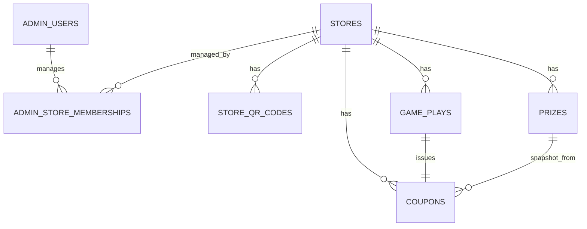

# ERD / DATABASE DESIGN

## ERD


## `admin_users`
| Column | Type | Note |
|---|---|---|
| id | BIGINT | PK |
| email | VARCHAR(255) | UNIQUE |
| password_hash | VARCHAR(255) | |
| name | VARCHAR(100) | |
| role | VARCHAR(30) | SYSTEM_ADMIN / STORE_ADMIN |
| created_at | DATETIME | |

## `stores`
| Column | Type | Note |
|---|---|---|
| id | BIGINT | PK |
| name | VARCHAR(100) | 매장명 |
| business_number | VARCHAR(30) | nullable |
| phone | VARCHAR(30) | |
| address | VARCHAR(255) | |
| naver_place_url | VARCHAR(500) | |
| staff_pin_hash | VARCHAR(255) | 6자리 PIN hash |
| status | VARCHAR(20) | ACTIVE / INACTIVE |
| created_at | DATETIME | |
| updated_at | DATETIME | |

## `admin_store_memberships`
| Column | Type | Note |
|---|---|---|
| id | BIGINT | PK |
| admin_user_id | BIGINT | FK |
| store_id | BIGINT | FK |
| role | VARCHAR(30) | OWNER / MANAGER |
| created_at | DATETIME | |

제약:
```text
UNIQUE(admin_user_id, store_id)
```

## `store_qr_codes`
| Column | Type | Note |
|---|---|---|
| id | BIGINT | PK |
| store_id | BIGINT | FK |
| public_token | VARCHAR(100) | UNIQUE |
| status | VARCHAR(20) | ACTIVE / REVOKED |
| created_at | DATETIME | |
| revoked_at | DATETIME | nullable |

## `prizes`
| Column | Type | Note |
|---|---|---|
| id | BIGINT | PK |
| store_id | BIGINT | FK |
| tier | VARCHAR(20) | TIER_1/2/3 |
| name | VARCHAR(100) | |
| description | VARCHAR(500) | |
| redeem_policy | VARCHAR(30) | SAME_DAY/NEXT_DAY/ANYTIME |
| active | BOOLEAN | |
| created_at | DATETIME | |
| updated_at | DATETIME | |

제약:
```text
UNIQUE(store_id, tier)
```

## `game_plays`
| Column | Type | Note |
|---|---|---|
| id | BIGINT | PK |
| public_id | CHAR(26) | ULID 권장 |
| store_id | BIGINT | FK |
| qr_code_id | BIGINT | FK |
| customer_name_encrypted | TEXT | AES-256-GCM |
| phone_hash | CHAR(64) | HMAC-SHA256 |
| phone_encrypted | TEXT | AES-GCM |
| phone_last4 | CHAR(4) | |
| yut_result | VARCHAR(20) | DO/GAE/GEOL/YUT/MO |
| reward_tier | VARCHAR(20) | |
| status | VARCHAR(20) | CREATED/REVEALED/CANCELLED |
| animation_seed | VARCHAR(100) | |
| idempotency_key | VARCHAR(100) | UNIQUE |
| played_date | DATE | Asia/Seoul |
| played_at | DATETIME | |
| revealed_at | DATETIME | nullable |

인덱스:
```text
INDEX(store_id, phone_hash, played_date)
INDEX(store_id, phone_hash, played_at)
INDEX(store_id, played_at)
```

## `coupons`
| Column | Type | Note |
|---|---|---|
| id | BIGINT | PK |
| store_id | BIGINT | FK |
| game_play_id | BIGINT | FK, UNIQUE |
| prize_id | BIGINT | FK |
| coupon_token | VARCHAR(100) | UNIQUE |
| phone_hash | CHAR(64) | 조회 최적화 |
| prize_name_snapshot | VARCHAR(100) | |
| prize_description_snapshot | VARCHAR(500) | |
| redeem_policy_snapshot | VARCHAR(30) | |
| status | VARCHAR(20) | ISSUED/REDEEMED/EXPIRED/CANCELLED |
| valid_from | DATETIME | |
| expires_at | DATETIME | |
| issued_at | DATETIME | |
| redeemed_at | DATETIME | nullable |

인덱스:
```text
INDEX(store_id, phone_hash, status)
INDEX(store_id, status)
INDEX(store_id, expires_at)
```

## 전화번호 저장 규칙
입력:
```text
010-1234-5678
```
정규화:
```text
01012345678
```
저장:
```text
phone_hash      = HMAC-SHA256(normalizedPhone)
phone_encrypted = AES-GCM(normalizedPhone)
phone_last4     = 5678
```

## 쿨타임 계산
최근 `played_date`를 조회하고:
```text
nextPlayableDate = lastPlayedDate + 2 days
```
오늘이 `nextPlayableDate` 이상이면 참여 가능.

## 미사용 쿠폰 우선조회
조건:
```text
store_id = 현재 매장
phone_hash = 현재 고객
status = ISSUED
```
가장 최근 쿠폰 1개를 우선 반환한다.
